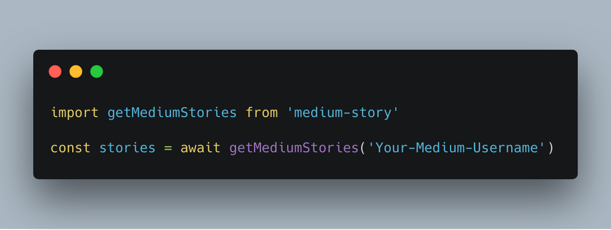
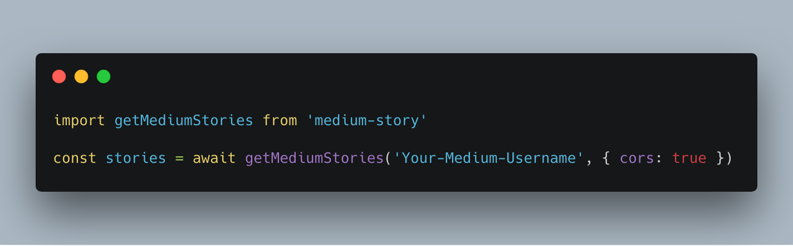
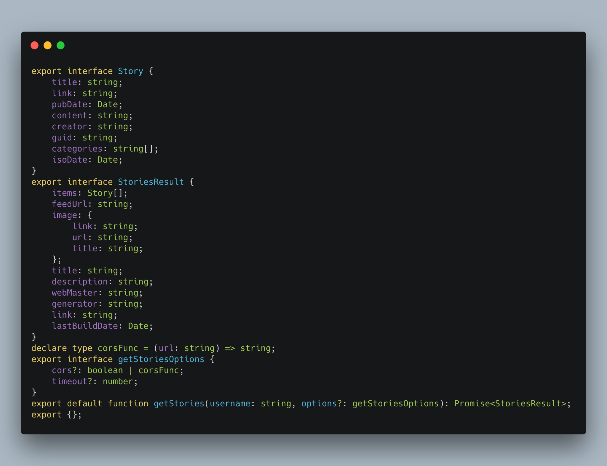

# medium-story

**medium-story** is a package used to fetch medium stories.

## Features

* Fetch stories from medium.com, by rss feed.
* Works in both browser and node environment.
* Typescript support.

## Usage

### Node

### Browser

## Types

## Explain

**medium-story** use [medium feeds](https://help.medium.com/hc/en-us/articles/214874118-RSS-feeds) to get latest stories from specified account.

Thanks to [cors.io](https://cors.io/), you can use it in browser, too!

Due to medium's limit, you can only get recent **10** stories.